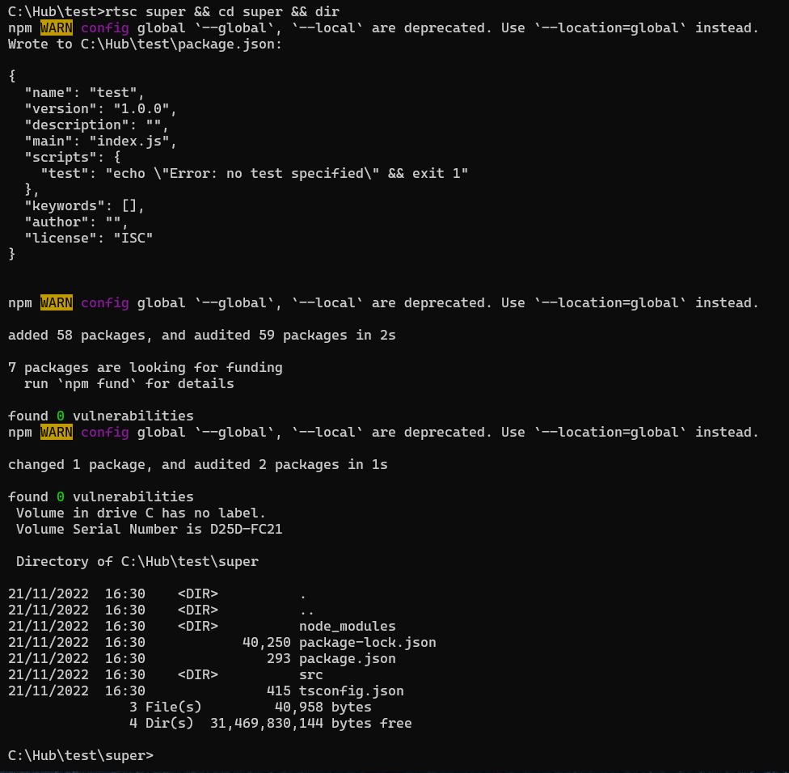

# RTSC - Rust TypeScript Creator

Instead of:
``` Bash
$ mkdir super_backend
$ cd super_backend
$ npm init -y --location=project
$ npm install express dotenv --location=project
$ npm install typescript --location=global
$ npx tsc init
$ mkdir src
$ touch ./src/index.ts
```
You can use:
``` Bash
rtsc super_backend
```
Pretty simple, right?  
Despite the fact that I originally wrote this in bash, I decided to write something similar in Rast, since I am learning it.

# How to install binary app #1
Download executable file from releases page, put this file somewhere in your pc and add path to that folder in your system Path var and restart shell.  
Then you can use ```rtsc``` command in cmd.
# How to install from source code #2 
> [!NOTE] Before you need make sure you have installed rust on your pc.
``` Bash
git clone https://github.com/denver-code/rtsc
cd rtcs
cargo build --release
```
Then do steps from ```"How to install from source code #2"``` section with your ```./target/release/rstc.exe```
# How to install rust
```
curl https://sh.rustup.rs -sSf | sh
```